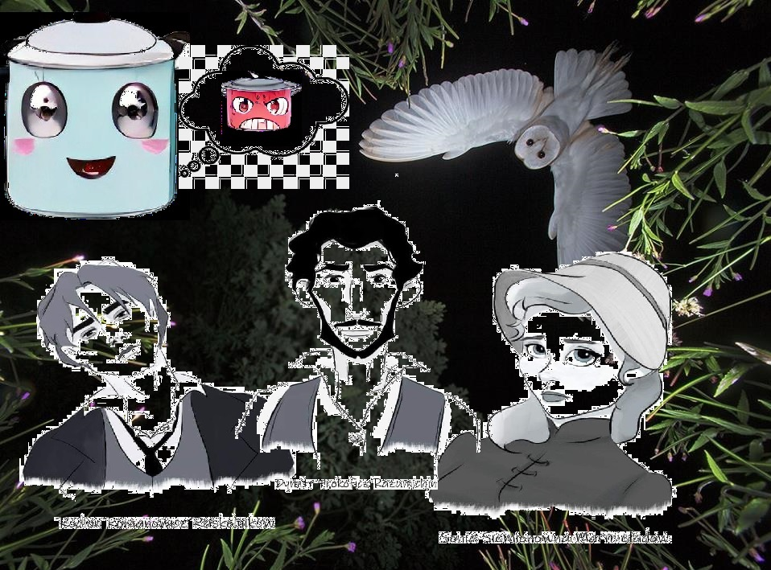

### Otlichnyj Gorshok

•	Gra jest fabularna, użytkownik przechodzi przez fabułę (przez świat prowadzi go garnek)

•	Mapa świata jest podzielona na kilka regionów (z przejście danego regionu otrzymuje nagrodę w postaci nowej umiejętności) -> regiony ułożone w sposób procesu produkcji granka (co jest potrzebne do wyprodukowania garnka … ? drewno, minerały (stal, węgiel), piasek -> szkło, fabryki, piece ogień, cyber -.-); w każdym regionie jest kilka (9 min.) mobów do pokonania, na końcu każdego regionu jest do pokonania boss (lub bossy max.3). Regiony mogą mieć kilka części w jednym (podział na subregiony)

•	Za pokonanie wroga gracz otrzymuje punkty za które może ulepszać swoje umiejętności, w przypadku pokonania bossa regionu użytkownik otrzymuje nową umiejętność 

•	Gracz za każdym razem może zmienić umiejętności jednak jest to ograniczone do maksymalnie dwóch (skill i ult), aby użyć ulta użytkownik może przeczekać atak użytkownika albo rozwiązać zagadkę (potrzebne jest 3 punkty za użycie skilla oraz 5 za użycie ulta; maksymalnie kumuluje się do 6 punktów), za każde przeczekanie lub rozwiązanie zagadki użytkownik dostaje 1 punkt (można wybrać czy czekamy, czy rozwiązujemy zagadkę), natomiast na czekania użytkownik traci hp (tak samo w przypadku błędnie rozwiązanej zagadki - %hp) 

•	Zagadki są na poziomie regionu (im dalej tym ciężej) i obejmują zagadnienia z matematyki, fizyki informatyki (sieci + programowanie)

•	Długoterminowość - rozwiązanie: … CZYLI CO ZROBIĆ ŻEBY GRA NIE BYŁA NUDNA (clicker, dobra ekonomia gry, sklep, lvl - ograniczenia, exp, balans, daily regeneracja HP -> wprowadza to limit pokonanych mobów/dzień) 

•	Pobieranie i zapis danych z bazy danych MySQL (AGH) - opcjonalne (późniejsza faza rozwoju gry)

•	Użytkownik na pewnym etapie gry otrzymuje sojuszników, których może ulepszać

•	Do konfiguracji korzystamy z plików yaml (.yml) (https://yaml.org/spec/1.2.2/)

•	Wykorzystywane obrazki generujemy ze strony (https://www.craiyon.com/) i zapisujemy w folderze images na GoogleDrive (motywy regionów, aby wygenerować podobne należy dopisać painted by van gogh)

### Linki
[Python Docs](https://docs.python.org/3.10/)\
[YAML](https://yaml.org/spec/1.2.2/)\
[Crayion](https://www.craiyon.com/)\
[Mail](https://poczta.agh.edu.pl)

### Meetings (Otlichnyj Gorshok)
|  Date   |                            Komentarz                            |
|:-------:|:---------------------------------------------------------------:|
| 14.11.2022 | Omówienie zagadnień związanych z grą (pomysł) | 
| 21.10.2022 | Generowanie obrazków                     | 
| 28.10.2022 |                     Tworzenie interefejsu graficznego i algorytmu odczytującego story questy                   | 
| 05.12.2022 |                 Mechaniki bossów                |

### Schedule WDI
|  Date   |                            Komentarz                            |
|:-------:|:---------------------------------------------------------------:|
| 04.10.2022 / 05.10.2022 | Zajęcia odwołane ze względu na godziny rektorskie i dziekańskie | 
| 11.10.2022 / 12.10.2022 |                      Zajęcia organizacyjne                      | 
| 18.10.2022 / 19.10.2022 |                     Narzędzia informatyczne                     | 
| 25.10.2022 / 26.10.2022 |                 <b><u>Programowanie 1 </u> </b>                 |
| 08.11.2022 / 09.11.2022 |                    Narzędzia informatyczne 2                    |
| 15.11.2022 / 16.11.2022 |                 <b><u>Programowanie 2 </u> </b>                 |
| 22.11.2022 / 23.11.2022 |                    Narzędzia informatyczne 3                    |
| 29.11.2022 / 30.11.2022 |                 <b><u>Programowanie 3 </u> </b>                 |
| 06.12.2022 / 07.12.2022 |                    Narzędzia informatyczne 4                    |
| 13.12.2022 / 14.12.2022 |                 <b><u>Programowanie 4 </u> </b>                 |
| 20.12.2022 / 21.12.2022 |                    Narzędzia informatyczne 5                    |
| 03.01.2022 / 04.01.2022 |                 <b><u>Programowanie 5 </u> </b>                 |
| 10.01.2022 / 11.01.2022 |                    Narzędzia informatyczne 6                    |
| 17.01.2022 / 18.01.2022 |                    Kolokwium (dla chętnych)                     |
| 24.01.2022 / 25.01.2022 |                    Narzędzia informatyczne 7                    |
